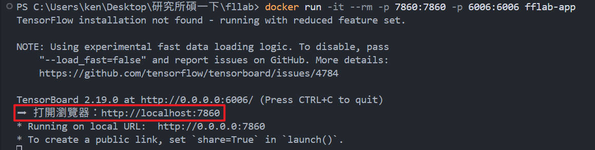
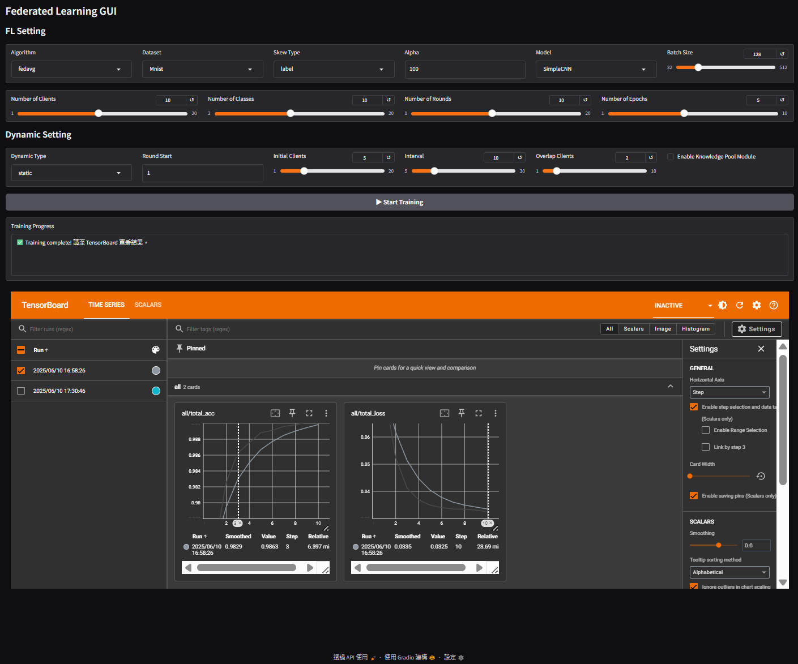

# Federated-Learning Lab (FFLab)

一鍵用 Docker 跑起 **Gradio + TensorBoard** 的 FL 研究環境。  
> 📦 Python 3.10 – PyTorch 2.2.2 (CPU) – Gradio – TensorBoard

---

## 目錄
1. [先決條件](#先決條件)
2. [取得原始碼](#取得原始碼)
3. [建置映像檔](#建置映像檔)
4. [啟動容器](#啟動容器)
5. [使用方式](#使用方式)
6. [常見問題](#常見問題)
7. [授權](#授權)

---

## 先決條件
- **Docker**  
  - Windows / macOS 👉 安裝 [Docker Desktop](https://www.docker.com/products/docker-desktop/)  
  - Linux 👉 使用發行版套件管理器（`sudo apt install docker.io`…）  

---

## 取得原始碼
```bash
git clone https://github.com/your-org/fflab.git
cd fflab
````

> 也可以直接下載 ZIP 解壓。

---

## 建置映像檔

```bash
docker build -t fflab-app .
```

* `-t fflab-app`：幫映像檔取名。
* `.`：以目前資料夾的 `Dockerfile` 為基礎。

---

## 啟動容器

```bash
docker run -it --rm -p 7860:7860 -p 6006:6006 fflab-app
```

參數說明

| 參數             | 作用                  |
| -------------- | ------------------- |
| `-it`          | 互動模式附加 TTY，方便看 log  |
| `--rm`         | 容器停止時自動刪除           |
| `-p 7860:7860` | 對映 Gradio port      |
| `-p 6006:6006` | 對映 TensorBoard port |

---

## 使用方式

1. 等待 Console 顯示

   ```
   Running on local URL:  http://0.0.0.0:7860
   TensorBoard 6006 ...
   ```
2. 打開瀏覽器：
    主要是 : http://localhost:7860
   * **Gradio UI** → [http://127.0.0.1:7860](http://127.0.0.1:7860)
   * **TensorBoard** → [http://127.0.0.1:6006](http://127.0.0.1:6006)
   
3. 在 UI 上調整參數 ➜ `▶ Start Training`
4. 於 TensorBoard 即時觀察 loss / accuracy 曲線。
    
---

## 常見問題

| 症狀                             | 解決方式                                                 |
| ------------------------------ | ---------------------------------------------------- |
| 瀏覽器顯示 `ERR_CONNECTION_REFUSED` | 確認 `docker run` 有 `-p 7860:7860`；Gradio 綁定 `0.0.0.0` |
| Port 被占用                       | 改用 `-p 7870:7860` 等對映                                |
| TensorBoard 無法訪問               | 同理加 `-p 6006:6006`；log\_dir 是否存在                     |

---

